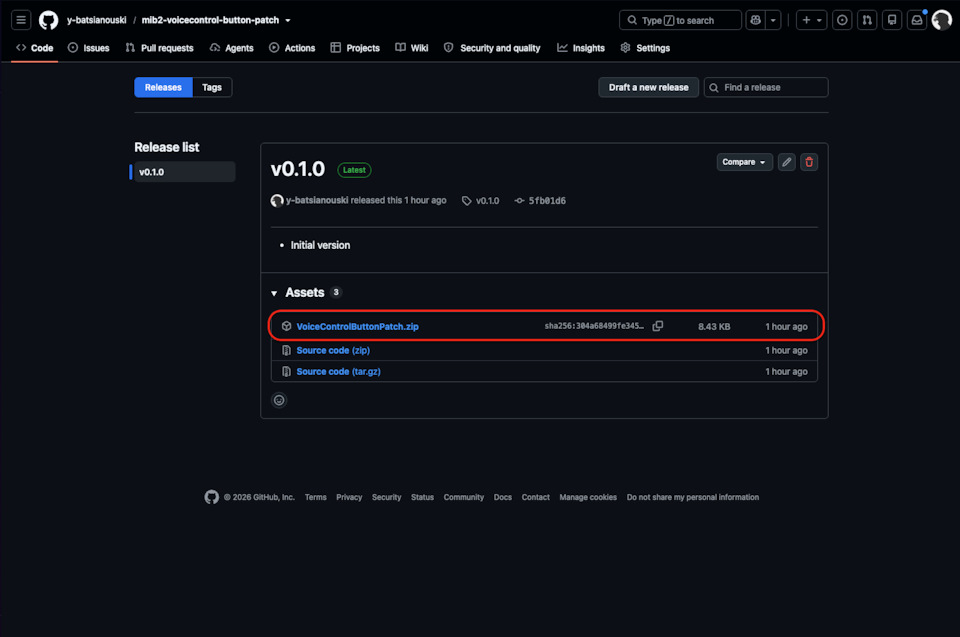
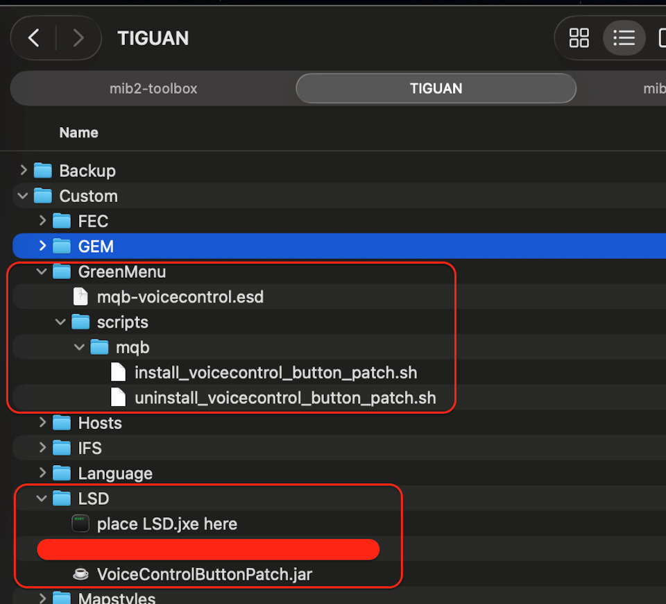
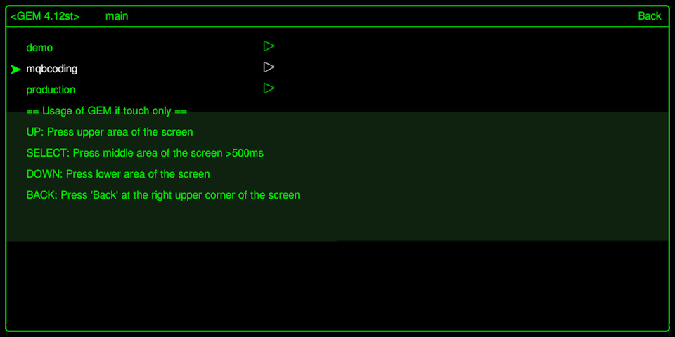
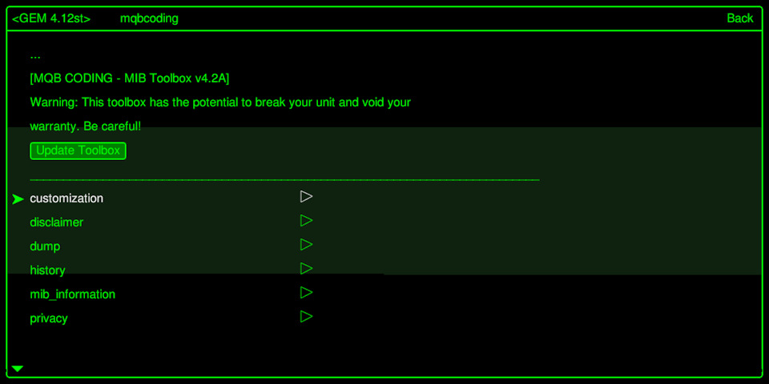
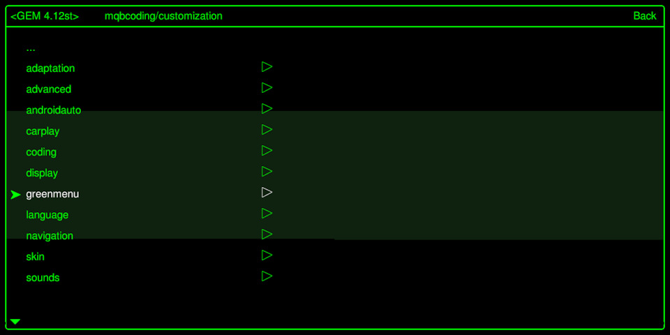
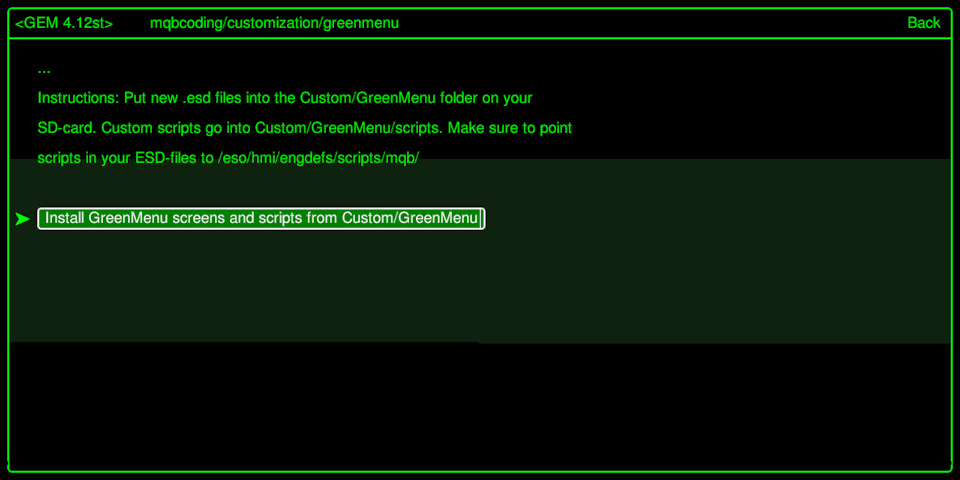
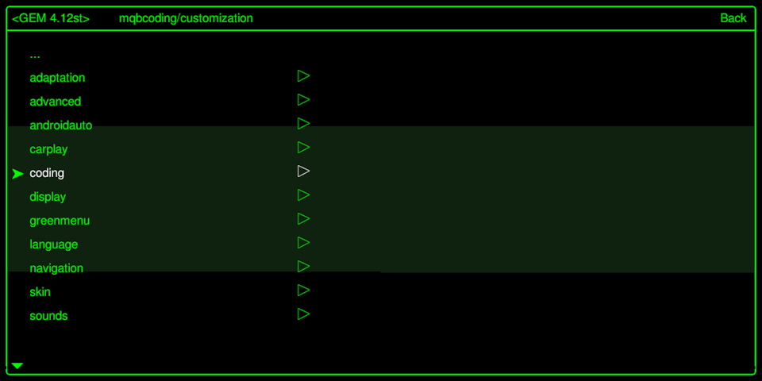
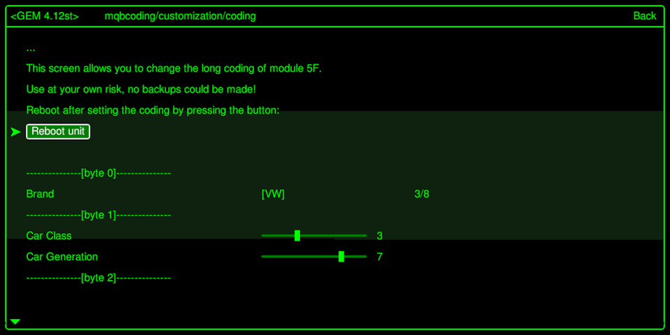
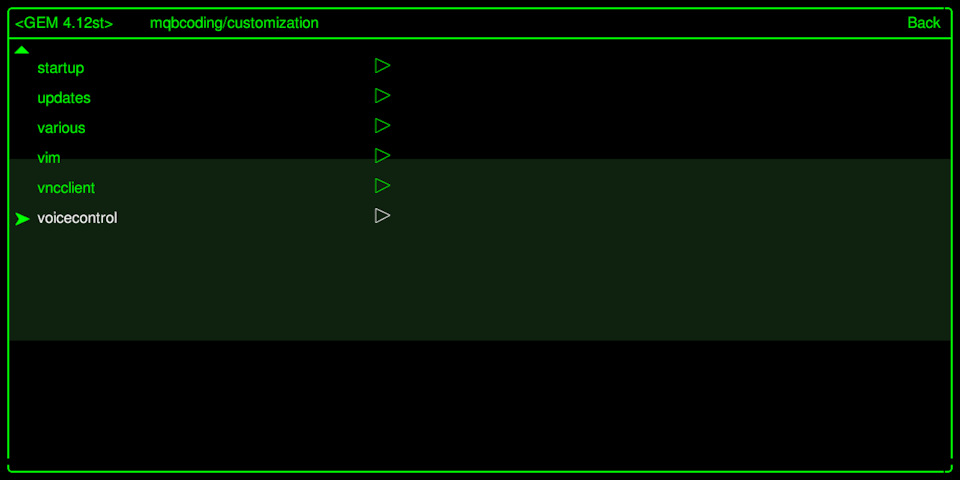
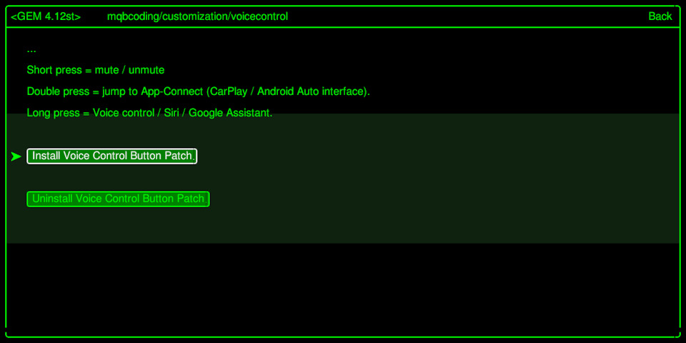

# Installation guide

Step-by-step installation with screenshots, translated from the original write-up:
[mib2-toolbox патч для кнопки Voice Control](https://www.drive2.ru/l/741760231985400113/) (DRIVE2, in Russian).

---

## ⚠️ Read this first

**If you do not have SSH access, and if you do not know how to back up and restore `lsd.sh` to a
working state — or if that sentence did not mean anything to you — please do not rush to be among
the first testers.**

The install scripts have been tested, but only on one car. No guarantee can be given yet.

At the time of writing this has only been tested on a Discover Pro running
**MHI2_ER_VWG13_K4525_MU1367** and latest [mib2-toolbox](https://github.com/jilleb/mib2-toolbox) from master.

---

## What you get

1. **Single press** — mute / unmute.
2. **Double press** — jump straight to App-Connect (the CarPlay / Android Auto interface, if a
   phone is connected) from anywhere else in the infotainment system.
3. **Long press**:
   - *CarPlay / Android Auto not active* — opens the built-in voice control.
   - *CarPlay / Android Auto connected* — opens Siri or Google Assistant respectively.

Built-in audio sources and CarPlay (tested with Spotify and YouTube) also **pause** playback on
mute. Android Auto behaviour is untested.

---

## Steps

### 0. Prerequisite

You need an SD card that is already set up with [mib2-toolbox](https://github.com/jilleb/mib2-toolbox).

### 1. Download the latest release

Get the newest version from the
[GitHub releases page](https://github.com/y-batsianouski/mib2-voicecontrol-button-patch/releases).



### 1.1. Clear out the old green-menu screens

It is recommended to delete everything inside **`Custom/GreenMenu`** on the SD card first, so that
no extra unwanted entries are added to the Green Menu.

### 2. Unpack onto the SD card

Extract the archive into the root of the SD card, agreeing to merge folders.

Alongside all the usual mib2-toolbox files, the card should now also contain:

- `Custom/LSD/VoiceControlButtonPatch.jar`
- `Custom/GreenMenu/mqb-voicecontrol.esd`
- `Custom/GreenMenu/scripts/mqb/install_voicecontrol_button_patch.sh`
- `Custom/GreenMenu/scripts/mqb/uninstall_voicecontrol_button_patch.sh`

For previous versions of mib2-toolbox it may be need to unpack install/unistall scripts without `mqb` subfolder:

- `Custom/GreenMenu/scripts/install_voicecontrol_button_patch.sh`
- `Custom/GreenMenu/scripts/uninstall_voicecontrol_button_patch.sh`



### 2.1. macOS users

If you are on a Mac, run this before ejecting the card, to strip the metadata files macOS scatters
across removable media:

```sh
# check your SDCARDNAME
ls /Volumes
# Clean SD card from MacOS system files
cd /Volumes/{SDCARDNAME} \
  && rm -rf System\ Volume\ Information \
  && dot_clean -m . \
  && rm -rf .fseventsd \
  && rm -rf .Trashes \
  && rm -rf .Spotlight-V100 \
  && find . -type f -name ".DS_Store" -print \
  && cd -
```

### 3. Install the green-menu screens

In the Green Menu go to
**mqbcoding → customization → greenmenu → Install GreenMenu screens and scripts from Custom/GreenMenu**.









### 4. Reboot the unit

Reboot the infotainment system from the Green Menu:
**mqbcoding → customization → coding → Reboot unit**.





### 5. Find the new menu entry

After the reboot a new item should appear at
**mqbcoding → customization → voicecontrol**.



### 6. Install the patch

Run the install action.



### 7. Reboot once more

**mqbcoding → customization → coding → Reboot unit**.

That's it — the button is remapped.

---

## Uninstalling

Same menu, choose the uninstall action, then reboot.

The uninstaller removes only its own bootclasspath entry, keyed on the jar name, so other patches
sharing `lsd.sh` are left untouched.
